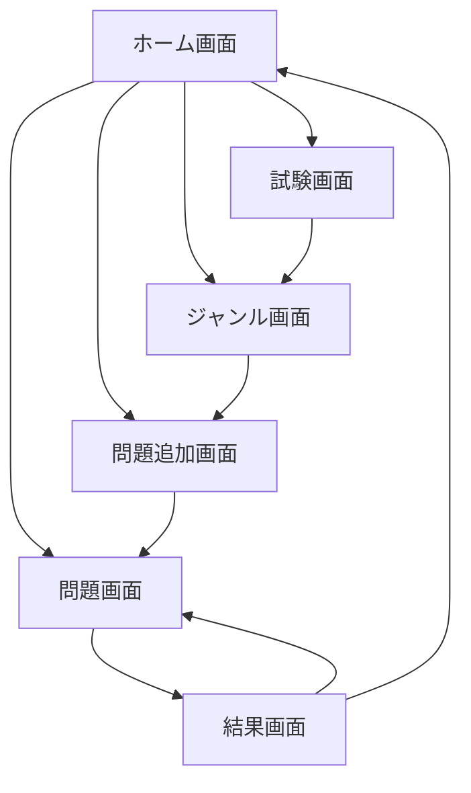

# 画面フロー設計

## 画面一覧

### 1. ホーム画面 (HomeScreen)

- メインナビゲーションハブ
- 各主要機能への遷移ボタン
  - 問題画面へ
  - ジャンル画面へ
  - 試験画面へ
  - 問題追加画面へ

### 2. 試験画面 (ExamScreen)

#### 主な機能

- 試験の一覧表示
- 試験の追加
- 試験の編集と削除

#### UI要素

- 試験一覧（リスト表示）
- 新規追加アイコンボタン（FAB）
- 各試験項目に対する編集・削除アイコン
- 試験追加/編集モーダル
  - 試験名入力フィールド
  - 試験詳細入力フィールド
  - 保存/更新/キャンセルボタン

### 3. ジャンル画面 (GenreScreen)

#### 主な機能

- 試験の選択
- ジャンルの一覧表示
- ジャンルの追加
- ジャンルの編集と削除

#### UI要素

- 試験選択ドロップダウン
- ジャンル一覧（リスト表示）
- 新規追加アイコンボタン（FAB）
- 各ジャンル項目に対する編集・削除アイコン
- ジャンル追加/編集モーダル
  - ジャンル名入力フィールド
  - 保存/更新/キャンセルボタン

### 4. 問題追加画面 (QuestionAddScreen)

#### 主な機能

- 試験の選択
- 問題の追加
- 問題の編集と削除
- 問題画面への遷移

#### UI要素

- 試験選択ドロップダウン
- 問題一覧（リスト表示）
- 新規追加アイコンボタン（FAB）
- 各問題項目に対する編集・削除アイコン
- 問題追加/編集モーダル
  - 問題文入力フィールド
  - 選択肢追加ボタン（最大8個）
  - 各選択肢の入力フィールドと正解チェックボックス
  - ジャンル選択ドロップダウン
  - 保存/更新/キャンセルボタン

### 5. 問題画面 (QuestionScreen)

#### 主な機能

- 問題解答
- スワイプナビゲーション
- タイマー計測
- 正解/不正解エフェクト
- 結果表示

#### UI要素

- 問題表示エリア
  - 問題文
  - 選択肢ボタン群
- タイマー表示（右上）
- スワイプインジケーター（上下スワイプ）
- 正解/不正解エフェクト表示
- モード選択
  - ランダム10問
  - 全問チャレンジ（ランダム/順序）
  - 間違えた問題のみ
  - ジャンル別フィルター

### 6. 結果画面 (ResultScreen)

#### 主な機能

- 結果サマリー表示
- 問題一覧表示（正解/不正解）
- 総所要時間表示
- リトライオプション

#### UI要素

- 成績サマリー
  - 正解数/総問題数
  - 総所要時間
- 問題一覧
  - 正解/不正解色分け表示
- リトライボタン
- ホームに戻るボタン

## 画面遷移フロー

