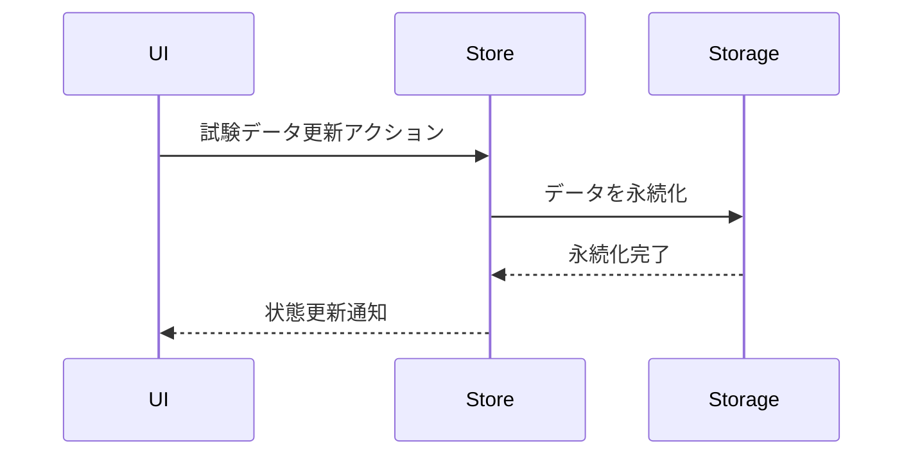
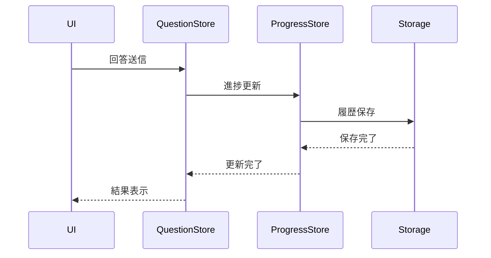

# 状態管理設計

## 状態管理の概要

このアプリケーションでは、以下の状態を管理する必要があります：

1. アプリケーション全体の状態
2. 画面固有の状態
3. 永続化データ（AsyncStorage）
4. UI状態

## 状態管理の実装

### 1. グローバル状態管理

```typescript
// src/stores/examStore.ts
interface ExamState {
  exams: Exam[];
  currentExam: Exam | null;
  loading: boolean;
  error: string | null;
}

// src/stores/progressStore.ts
interface ProgressState {
  wrongAnswers: WrongAnswer[];
  answerHistory: AnswerHistory[];
  loading: boolean;
  error: string | null;
}
```

### 2. 画面固有の状態

#### HomeScreen

```typescript
interface HomeScreenState {
  // 特別な状態は不要
}
```

#### ExamScreen

```typescript
interface ExamScreenState {
  modalVisible: boolean;
  selectedExam: Exam | null;
  isEditing: boolean;
}
```

#### QuestionScreen

```typescript
interface QuestionScreenState {
  currentQuestion: number;
  selectedAnswers: number[];
  timeStart: number;
  answeredQuestions: AnswerHistory[];
  mode: QuestionMode;
  isAnimating: boolean;
}

type QuestionMode = {
  type: 'random' | 'all' | 'wrong' | 'genre';
  count?: number;
  genre?: string;
  ordered?: boolean;
};
```

#### ResultScreen

```typescript
interface ResultScreenState {
  totalTime: number;
  correctCount: number;
  answers: AnswerHistory[];
  showRetryOptions: boolean;
}
```

### 3. 永続化データ管理

```typescript
// src/utils/storage.ts
class StorageManager {
  // 試験データの保存と取得
  async saveExams(exams: Exam[]): Promise<void>;
  async getExams(): Promise<Exam[]>;

  // 進捗データの保存と取得
  async saveProgress(progress: ProgressState): Promise<void>;
  async getProgress(): Promise<ProgressState>;

  // 個別データの更新
  async updateExam(exam: Exam): Promise<void>;
  async addAnswerHistory(history: AnswerHistory): Promise<void>;
  async addWrongAnswer(wrong: WrongAnswer): Promise<void>;

  // データの初期化
  async initializeStorage(): Promise<void>;
}
```

### 4. UI状態管理

```typescript
// src/hooks/useUIState.ts
interface UIState {
  isLoading: boolean;
  error: string | null;
  toast: {
    visible: boolean;
    message: string;
    type: 'success' | 'error' | 'info';
  };
  dialog: {
    visible: boolean;
    title: string;
    message: string;
    onConfirm: () => void;
    onCancel: () => void;
  };
}
```

## 状態更新フロー

### 1. 試験データの更新



### 2. 問題解答フロー



## エラーハンドリング

```typescript
// src/utils/errorHandler.ts
interface ErrorHandler {
  // ネットワークエラー
  handleNetworkError(error: Error): void;

  // データ永続化エラー
  handleStorageError(error: Error): void;

  // バリデーションエラー
  handleValidationError(error: ValidationError): void;

  // 予期せぬエラー
  handleUnexpectedError(error: Error): void;
}
```

## パフォーマンス最適化

1. メモ化による再レンダリング防止

```typescript
// src/components/QuestionCard.tsx
const MemoizedQuestionCard = React.memo(QuestionCard, (prev, next) => {
  return prev.question.id === next.question.id;
});
```

2. 状態更新の最適化

```typescript
// src/hooks/useDebounce.ts
function useDebounce<T>(value: T, delay: number): T;

// src/hooks/useThrottle.ts
function useThrottle<T>(value: T, limit: number): T;
```

3. リスト表示の最適化

```typescript
// src/components/QuestionList.tsx
interface QuestionListOptimizationProps {
  getItemLayout?: (
    data: any,
    index: number,
  ) => {
    length: number;
    offset: number;
    index: number;
  };
  windowSize?: number;
  maxToRenderPerBatch?: number;
  updateCellsBatchingPeriod?: number;
}
```

## 状態のリセットとクリーンアップ

```typescript
// src/stores/resetState.ts
interface StateReset {
  // 全状態のリセット
  resetAllState(): Promise<void>;

  // 特定の試験の状態リセット
  resetExamState(examId: number): Promise<void>;

  // 進捗データのリセット
  resetProgress(): Promise<void>;

  // UI状態のリセット
  resetUIState(): void;
}
```
