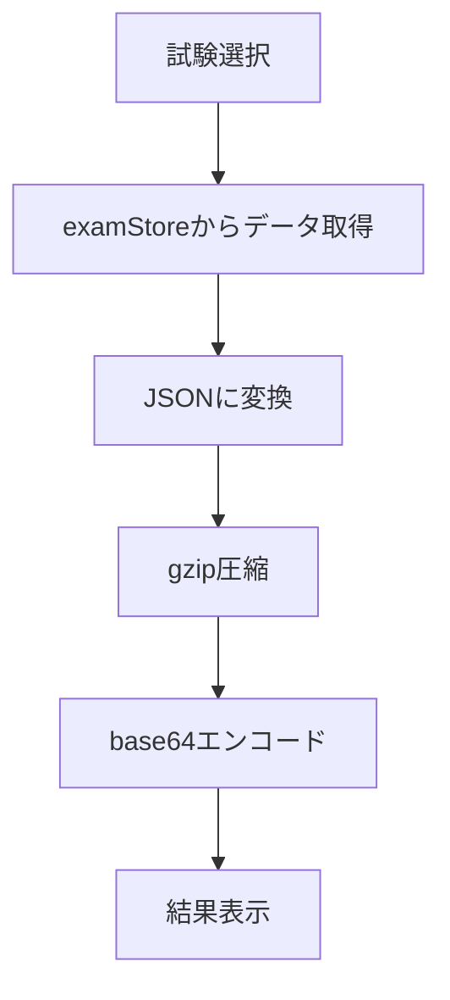

# JSONエクスポート/インポート機能設計

## 概要

試験データのバックアップとリストア機能を提供するため、JSONデータのエクスポートとインポート機能を実装します。

## 機能要件

1. エクスポート機能
   - 指定した試験IDのデータをJSONとして取得
   - JSONデータをgzipで圧縮
   - 圧縮データをbase64エンコード
   - エンコードされたテキストを表示/クリップボードにコピー

2. インポート機能
   - base64エンコードされたテキストを入力
   - base64デコード
   - gzip解凍
   - JSONデータをパース
   - examStoreに追加

## 画面設計

### エクスポート/インポート画面

#### UI要素
- 試験選択ドロップダウン（エクスポート用）
- エクスポートボタン
- エクスポート結果表示エリア
- コピーボタン
- テキスト入力エリア（インポート用）
- インポートボタン

#### レイアウト
```
+----------------------------------+
|           ヘッダー               |
+----------------------------------+
|  [試験を選択してください v]      |
|                                  |
|  [エクスポート]                  |
|                                  |
|  結果:                           |
|  +----------------------------+  |
|  |                           |  |
|  |                           |  |
|  +----------------------------+  |
|  [コピー]                       |
|                                  |
|  インポートするデータ:           |
|  +----------------------------+  |
|  |                           |  |
|  |                           |  |
|  +----------------------------+  |
|  [インポート]                   |
+----------------------------------+
```

## 技術設計

### データフロー

1. エクスポート


2. インポート


### 必要なユーティリティ関数

```typescript
// gzip圧縮/解凍
async function compressData(data: string): Promise<Uint8Array>;
async function decompressData(compressed: Uint8Array): Promise<string>;

// base64変換
function encodeBase64(data: Uint8Array): string;
function decodeBase64(encoded: string): Uint8Array;

// データ変換
async function examToExportData(examId: number): Promise<string>;
async function importExamData(data: string): Promise<void>;
```

### 使用するライブラリ

- pako: gzip圧縮/解凍用
- base-64: base64エンコード/デコード用
- @react-native-clipboard/clipboard: クリップボード操作用

## エラーハンドリング

1. エクスポート時
   - 試験が選択されていない
   - 試験データの取得に失敗
   - 圧縮処理に失敗

2. インポート時
   - 入力データが不正なbase64形式
   - gzip解凍に失敗
   - JSONパースに失敗
   - データ形式が不正
   - examStoreへの追加に失敗

## セキュリティ考慮事項

1. データ検証
   - インポートされるJSONの構造検証
   - 必須フィールドの存在確認
   - データ型の検証

2. サイズ制限
   - インポートされるデータのサイズ制限
   - 圧縮率の確認

## テスト計画

1. ユニットテスト
   - 圧縮/解凍機能
   - base64エンコード/デコード
   - データ変換関数

2. 統合テスト
   - エクスポート → インポートの一連の流れ
   - 異なるサイズのデータでの動作確認
   - エラーケースの確認