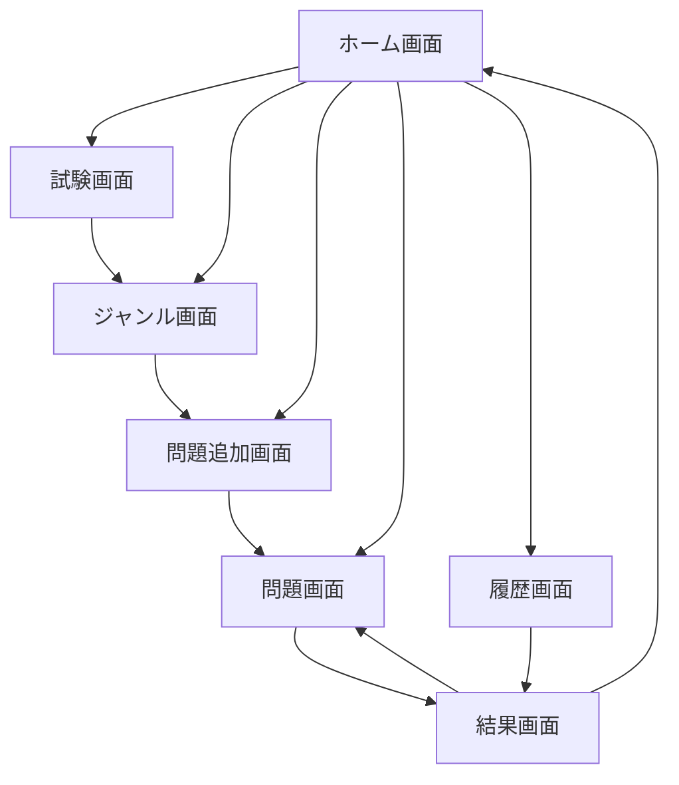
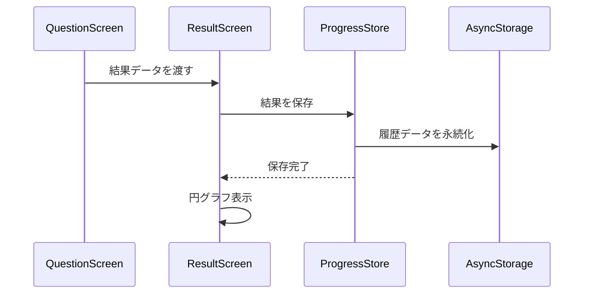

# 解答履歴機能設計

## 新規画面の追加

### HistoryScreen（履歴画面）

```typescript
// src/screens/HistoryScreen/
interface HistoryScreenProps {
  navigation: NavigationProp<RootStackParamList>;
}

// レイアウト
+----------------------------------+
|           履歴                   |
+----------------------------------+
|   試験選択ドロップダウン         |
|   +----------------------------+ |
|   |  試験を選択              v | |
|   +----------------------------+ |
|                                 |
|   正答率円グラフ                |
|   +----------------------------+ |
|   |                           | |
|   |         75%               | |
|   |                           | |
|   +----------------------------+ |
|                                 |
|   履歴一覧                      |
|   +----------------------------+ |
|   | 2024/02/23 15:30         | |
|   | 10問中8問正解            | |
|   | 所要時間：5分30秒        | |
|   +----------------------------+ |
|   | 2024/02/23 14:00         | |
|   | 5問中4問正解             | |
|   | 所要時間：2分45秒        | |
|   +----------------------------+ |
+----------------------------------+
```

## データモデルの拡張

### ResultHistory（結果履歴）

```typescript
interface ResultHistory {
  id: number;          // 履歴ID
  examId: number;      // 試験ID
  timestamp: number;   // 解答日時
  totalQuestions: number;  // 総問題数
  correctAnswers: number;  // 正解数
  totalTime: number;       // 総所要時間
  mode: QuestionMode;      // 解答モード
}

// ProgressStoreの拡張
interface ProgressState {
  wrongAnswers: WrongAnswer[];
  answerHistory: AnswerHistory[];
  resultHistory: ResultHistory[];  // 新規追加
}
```

## コンポーネント設計

### 1. ResultPieChart（正答率円グラフ）

```typescript
// src/components/result/ResultPieChart.js
interface ResultPieChartProps {
  correctCount: number;
  totalCount: number;
  size?: number;  // グラフのサイズ
  showLabel?: boolean;  // ラベル表示フラグ
}
```

### 2. HistoryList（履歴リスト）

```typescript
// src/components/history/HistoryList.js
interface HistoryListProps {
  histories: ResultHistory[];
  onPress: (history: ResultHistory) => void;
}

interface HistoryItemProps {
  history: ResultHistory;
  onPress: () => void;
}
```

## 状態管理の拡張

### ProgressStore の拡張

```typescript
class ProgressStore {
  // 既存のメソッド
  
  // 新規メソッド
  async addResultHistory(history: ResultHistory): Promise<void>;
  async getResultHistories(examId: number): Promise<ResultHistory[]>;
  async getExamStats(examId: number): Promise<{
    totalAnswered: number;
    correctAnswers: number;
    averageTime: number;
  }>;
  
  // キャッシュ削除
  async clearHistory(): Promise<void>;
  async clearHistoryByExamId(examId: number): Promise<void>;
}
```

## 画面遷移フロー



## データフロー

1. 問題解答完了時


## 設定画面の拡張

### データ管理セクション

```typescript
interface DataManagementProps {
  onClearHistory: () => void;
  onClearHistoryByExam: (examId: number) => void;
}

// レイアウト
+----------------------------------+
|           設定                   |
+----------------------------------+
|   データ管理                     |
|   +----------------------------+ |
|   | 履歴データをクリア        | |
|   +----------------------------+ |
|   | 試験別履歴データをクリア  | |
|   +----------------------------+ |
|                                 |
```

## 実装手順

1. データモデルの実装
   - ResultHistory インターフェースの作成
   - ProgressStore の拡張
   - キャッシュクリア機能の追加

2. コンポーネントの実装
   - ResultPieChart コンポーネントの作成
   - HistoryList コンポーネントの作成

3. 画面の実装
   - HistoryScreen の作成
   - 結果画面の更新
   - ホーム画面に履歴ボタン追加
   - 設定画面にデータ管理セクション追加

4. テスト実装
   - 履歴保存のテスト
   - 統計計算のテスト
   - UI表示のテスト
   - キャッシュクリア機能のテスト

## エラーハンドリング

1. データ保存エラー
   - 保存失敗時のリトライ
   - エラーメッセージの表示

2. データ読み込みエラー
   - デフォルト値の表示
   - エラー状態の表示

3. キャッシュクリアエラー
   - クリア失敗時の再試行
   - ユーザーへのフィードバック

## パフォーマンス考慮事項

1. 履歴データのページング
   - 大量のデータの効率的な表示
   - 無限スクロール実装

2. 統計計算の最適化
   - キャッシュの活用
   - バックグラウンド計算

## アクセシビリティ

1. 円グラフ
   - 色覚異常者への配慮
   - 代替テキストの提供

2. 履歴リスト
   - スクリーンリーダー対応
   - キーボード操作対応

3. キャッシュクリア
   - 確認ダイアログの表示
   - 取り消し可能な操作